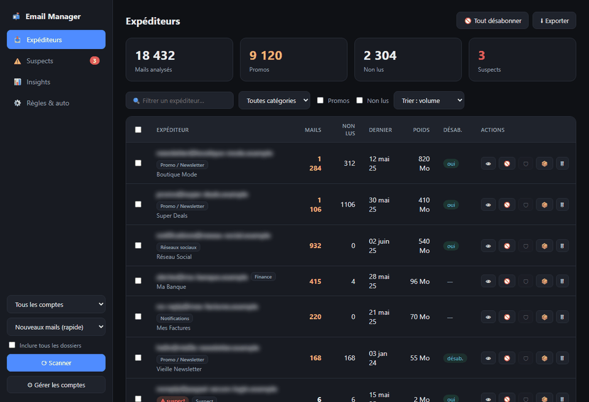
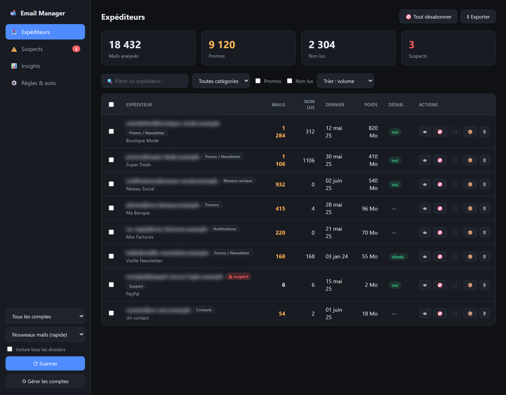
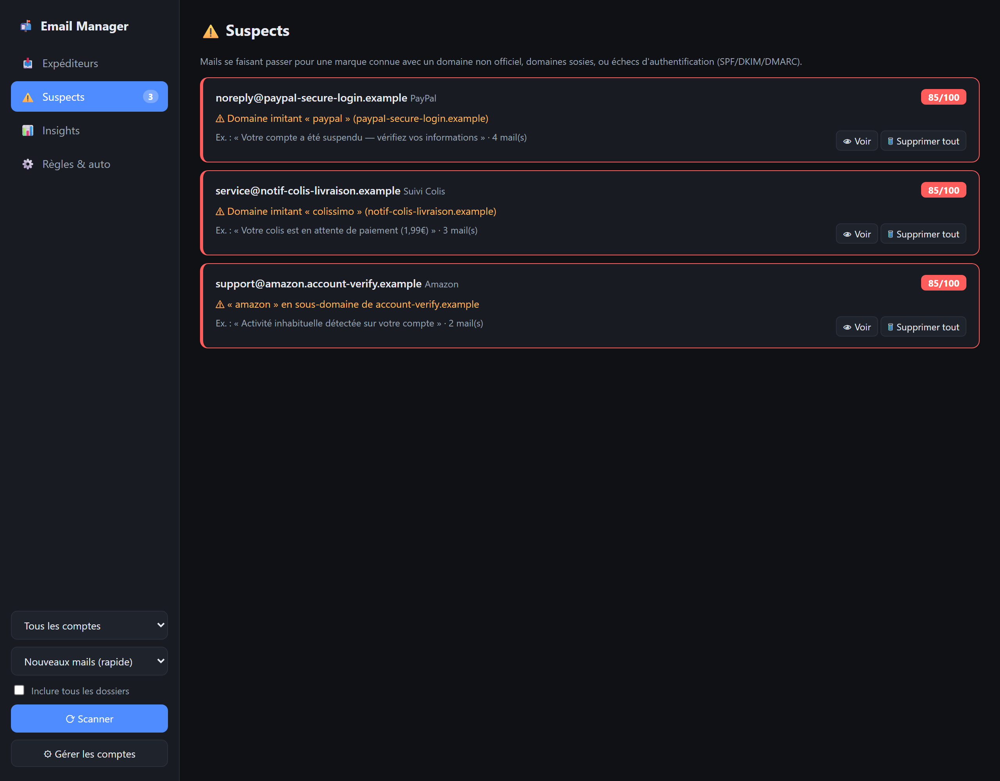
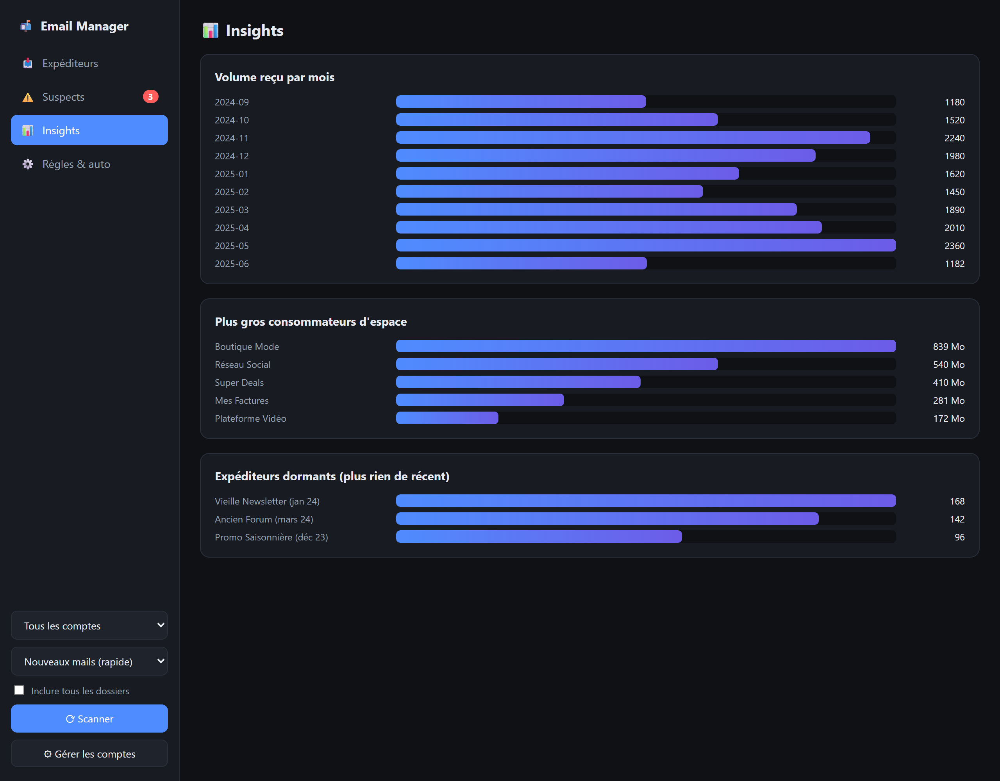

# 📬 Email Manager


**Français** · [English](README.en.md)

> Tableau de bord **local** pour analyser, nettoyer et sécuriser ses boîtes mail
> multi-comptes — détection des newsletters, désabonnement de masse, repérage du
> phishing par usurpation de marque, et tri automatique.

Email Manager se connecte à tes boîtes en **IMAP** (Outlook via OAuth, Gmail,
Yahoo, Free, iCloud…), analyse les en-têtes de tes messages **sans rien envoyer
à l'extérieur**, et te donne un tableau de bord pour reprendre le contrôle :
qui te spamme, qui usurpe une marque, qui dort, et comment faire le ménage en
quelques clics.

🔒 **100 % local & privé.** Aucune donnée ne quitte ta machine. Les comptes, les
identifiants et le cache des messages restent dans le dossier `data/`, exclu du
dépôt git.

---

## 🖼 Aperçu



### Tableau de bord — expéditeurs classés, catégorisés, actionnables


### 🛡 Détection de phishing / usurpation de marque


### 📊 Insights — volume, espace, expéditeurs dormants


> Captures réalisées avec des **données de démonstration** ; les adresses sont
> de surcroît floutées. Aucune donnée réelle n'est utilisée.

---

## ✨ Fonctionnalités

- **Multi-comptes** — Outlook / Hotmail (OAuth2), Gmail, Yahoo, iCloud, Free,
  Orange… (tout fournisseur IMAP). Serveur IMAP auto-détecté par domaine.
- **Scan multi-dossiers** — boîte de réception, Spam, Archives… avec **modes de
  vitesse** : *nouveaux mails* (incrémental, quasi instantané), *3 mois*,
  *1 an* ou *complet*. Récupération **parallélisée** (plusieurs connexions IMAP).
- **Détection promo / newsletter** via l'en-tête `List-Unsubscribe`, et repérage
  des **mails non lus** (le meilleur indice d'expéditeur à nettoyer).
- **🛡 Anti-phishing / usurpation de marque** — repère les domaines imitant une
  marque (`paypal-secure.com`, `notif-colissimo-x.info`), l'usage d'une marque
  en sous-domaine d'un domaine étranger, et le nom affiché d'une marque envoyé
  depuis une adresse perso ou échouant à DMARC. Logique **à mots entiers**, pensée
  pour minimiser les faux positifs.
- **Catégorisation** automatique : Promo, Réseaux sociaux, Finance, Notifications,
  Contacts, Suspect.
- **Désabonnement** unitaire ou **de masse** : *one-click* HTTP (RFC 8058) avec
  repli sur le désabonnement par e-mail (`mailto:` en SMTP).
- **Actions groupées** : supprimer (corbeille), archiver, déplacer — par
  expéditeur, sur tous les comptes à la fois.
- **Règles automatiques** + **expéditeurs protégés** (jamais supprimés) +
  **scan programmé** (quotidien / hebdomadaire).
- **Insights** : volume reçu par mois, plus gros consommateurs d'espace,
  expéditeurs dormants.
- **Export** Excel / CSV.

---

## 🗂 Structure du projet

```
email-manager/
├── backend/                 # API FastAPI + logique IMAP/SMTP/OAuth
│   ├── main.py              # routes API, orchestration du scan
│   ├── imap_client.py       # connexion IMAP, scan parallèle, actions
│   ├── oauth_ms.py          # OAuth2 Microsoft (flux device-code)
│   ├── smtp_client.py       # envoi SMTP (désabonnement mailto)
│   ├── phishing.py          # détection d'usurpation de marque
│   ├── categorize.py        # catégorisation des expéditeurs
│   ├── rules.py             # règles de tri + expéditeurs protégés
│   ├── scheduler.py         # scan automatique programmé
│   ├── unsubscribe.py       # désabonnement HTTP / mailto
│   └── db.py                # stockage local (SQLite + keyring)
├── frontend/                # interface web (HTML/CSS/JS, sans build)
│   ├── index.html
│   ├── app.js
│   └── style.css
├── data/                    # données locales (ignorées par git)
├── requirements.txt
├── run.bat                  # lancement Windows
└── run.sh                   # lancement Linux / macOS
```

---

## 🚀 Installation & lancement

**Prérequis :** Python 3.10+.

```bash
# Windows
run.bat

# Linux / macOS
./run.sh
```

Le premier lancement crée l'environnement virtuel et installe les dépendances
automatiquement, puis démarre le serveur sur **http://127.0.0.1:8000**.

<details>
<summary>Lancement manuel</summary>

```bash
python -m venv .venv
.venv/Scripts/pip install -r requirements.txt      # Windows
# .venv/bin/pip install -r requirements.txt        # Linux/macOS
cd backend
python -m uvicorn main:app --host 127.0.0.1 --port 8000
```
</details>

---

## 🔑 Connexion des comptes

### Outlook / Hotmail / Live — OAuth (obligatoire)

Microsoft a désactivé l'IMAP par mot de passe sur les comptes personnels. La
connexion se fait via **OAuth** (authentification dans le navigateur, aucun mot
de passe stocké). Pour éviter de créer une application Azure, l'outil utilise par
défaut l'**ID d'application public de Mozilla Thunderbird** (usage personnel).

Dans **⚙ Comptes → onglet Outlook**, saisis ton adresse, clique sur *Connexion*,
recopie le code affiché sur la page Microsoft et accepte les autorisations. Tu
peux fournir ton propre `client_id` Azure dans la section « Avancé ».

### Gmail / Yahoo / iCloud / autres — mot de passe d'application

Ces fournisseurs exigent un **mot de passe d'application** (après activation de
la double authentification) :

| Fournisseur | Où le créer |
|-------------|-------------|
| **Gmail** | Compte Google → Sécurité → Validation en 2 étapes → *Mots de passe des applications* (IMAP activé dans Gmail) |
| **Yahoo** | Sécurité du compte → *Générer un mot de passe d'application* |
| **iCloud** | appleid.apple.com → *Mots de passe pour applications* |
| **Free / Orange / SFR** | Espace abonné |

---

## 🧭 Utilisation

1. **⚙ Comptes** → ajoute tes adresses.
2. Choisis un **mode de scan** (commence par *3 derniers mois* pour un résultat
   rapide) puis **⟳ Scanner**. Après un premier scan, *Nouveaux mails* ne relit
   que le courrier récent (quasi instantané).
3. Explore les 4 vues :
   - **Expéditeurs** — classés par volume ; filtre par catégorie / non-lus ;
     actions par expéditeur ou en masse.
   - **Suspects** — les mails de phishing / usurpation détectés, avec le motif.
   - **Insights** — volume, espace, expéditeurs dormants.
   - **Règles & auto** — règles de tri, expéditeurs protégés, scan programmé.

> ⚠️ Les actions **Supprimer**, **Archiver** et **Tout désabonner** modifient
> réellement tes boîtes. Ajoute tes contacts et ta banque aux **expéditeurs
> protégés** avant un nettoyage de masse.

---

## 🔐 Sécurité & vie privée

- **Tout est local** : l'application tourne sur `127.0.0.1`, aucune donnée n'est
  transmise à un tiers (hors la connexion directe à ton fournisseur de mail).
- **Identifiants** : stockés dans le gestionnaire d'identifiants du système
  (Windows Credential Manager / Keychain) lorsqu'il est disponible, sinon dans
  `data/accounts.json` en local.
- Le dossier **`data/` est exclu du dépôt git** (`.gitignore`) : comptes, jetons
  et cache des messages ne sont jamais versionnés ni partagés.
- L'analyse ne lit que les **en-têtes** des messages (expéditeur, objet, date,
  `List-Unsubscribe`, `Authentication-Results`), pas le corps des e-mails.

---

## 🛠 Stack technique

- **Backend** : Python, FastAPI, Uvicorn, IMAPClient, keyring, openpyxl.
- **Frontend** : HTML / CSS / JavaScript natif (aucune étape de build).
- **Stockage** : SQLite (cache) + JSON (config) + keyring (secrets).

---

## ⚖️ Avertissement

Cet outil est fourni « tel quel », pour un usage personnel. Les opérations de
suppression et de désabonnement de masse sont puissantes : vérifie tes filtres
et utilise la liste d'expéditeurs protégés. Les auteurs déclinent toute
responsabilité en cas de perte de courrier.

## 📄 Licence

[MIT](LICENSE).
